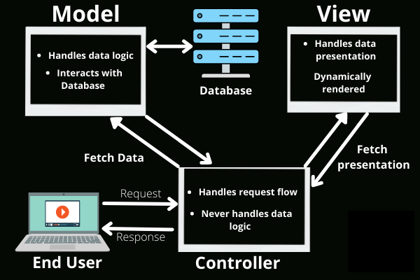
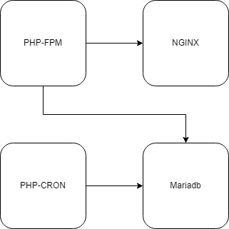
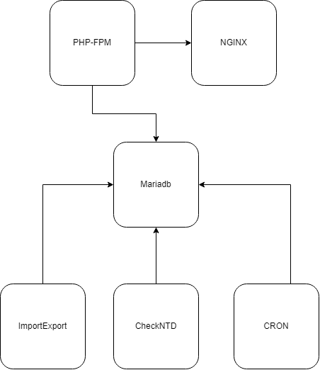
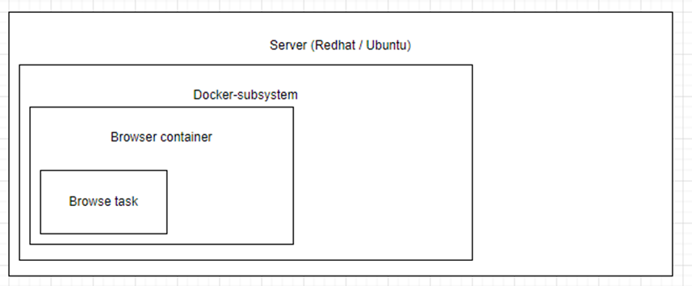

# Architectural

---

## Application 

The application is based on the following Model-View-Controle frameworks:

- Laravel version 9.1 or higher
- WinterCMS version 1.2.5 or higher

The Model-View-Controller (MVC) framework is an architectural/design pattern that separates 
an application into three main logical components Model, View, and Controller. 
Each architectural component is built to handle specific development aspects of an application. 
It isolates the business logic and presentation layer from each other. It was traditionally 
used for desktop graphical user interfaces (GUIs). Nowadays, MVC is one of the most frequently
used industry-standard web development frameworks to create scalable and extensible 
applications.

Futhermore Object-Oriented Programming (OOP) is used for development of the software. 
OOP is a programming paradigm based on the concept of objects, which can contain data 
and code: data in the form of fields (often known as attributes or properties), and 
code in the form of procedures (often known as methods). In OOP, computer programs 
are designed by making them out of objects that interact with one another.

Important is the use of the WinterCMS framework. SCARt uses as much as possible the 
standard functionality of this framework. See here for the [WinterCMS Development Guide](https://wintercms.com/docs/v1.2/docs/architecture/developer-guide#html-element-naming).

SCARt also adapts the version numbering of "major.minor.point". For example v1.0.1 or v5.3.2.

- **major**; should be increased for substantial changes made to the plugin, such as complete 
rewrites or pivoting of the purpose of the plugin. These changes are assumed to be 
backwards-incompatible and will require manual intervention by the users of the plugin. 
- **minor**; should be increased for smaller changes or new features that may still be 
backwards-incompatible with adequate justification. This can include changes to the 
database schema or changes to component settings. 
- **point**; should be increased for minor fixes, translation updates or very minor new 
features that maintain backwards compatibility.

Release notes are referencing to a version and contain (if applicable) the following 
elements:

- Breaking changes 
- New features
- Other changes
- Bug fixes
- Translation updates

See here for more information about the versioning: [WinterCMS plugin version history](https://wintercms.com/docs/v1.2/docs/plugin/updates).

## Containers

The MVC is futher enhanced in SCART by containerizing the different system components. This 
makes them scalable and provide failover functionality. With containers the application 
components are also placed in a seperated (local) network.

A basic container setup:

You see the basic system components. The PHP-FPM is (only) used for the frontend processing 
and servers the UI. The PHP-CRON is responsible for the background processes.

## Background processes

Within the PHP-CRON the background work exists of the following jobs:

| Name          | Description                                                                                                                           |
|:--------------|:--------------------------------------------------------------------------------------------------------------------------------------|
| ImportExport  | Import by email or ICCAM the reports                                                                                                  | 
| AnalyzeInput  | Read the imported reports, scrape them and get the WhoIs information                                                                  |
| CheckNTD      | Checks if the illegal reports are still online and the WHoIs the same (*)                                                             | 
| SendNTD       | Send NTD by email (or API) to the hoster, registrar, site owner or LEA                                                                | 
| SendAlert     | Send alerts to the info mailbox about the actions done by the background jobs                                                         | 
| UpdateWHoIs   | Update the WhoIs every 12 hours                                                                                                       | 
| CreateReports | Create the user reports (export CSV files)                                                                                            | 
| Cleanup       | Every night this background job runs to cleanup the SCARt environment (*)                                                             | 
| Archive       | In some SCARt environments the number of reports are such big, archiving is needed to keep the runtime performance optimized | 

(*) see seperated chapters for more information

It's easy within docker to make for each of these jobs a seperated container. In this 
way the performance can be optimzied. 

The following container setup is an example for an optimized setup:

In this setup the ImportExport and CheckNTD are placed in a seperated containers with 
an own work and resource environment.

## Realtime online check

The CheckNTD job is responsible for the check if an URL is still online.

The standard CheckNTD job is a single PHP job (threat) which starts a headless browser an 
checks each URL. 

For bigger hotlines with a lot of illegal URLs to check, there is also the realtime version 
of the CheckNTD job. This realtime version used pooling to start and stop dynamically threats 
for checking the online status. Configuration consist of:

- maximum time within an URL has be checked again (default 4 hours)
- minimum time after which an uRL has to be checked (default 1 hour)
- minimum time after which spinning down a worker (default 15 min) 

There is no limit from the number of concurrent threats other then the resources on the 
hosting server(s). 

Note that the threat job not only checks the online status of an image but also the 
WhoIs information. The hosting (country) information can be changed. On that moment the 
report is placed in the status "CHANGED". 

A report is set "offline" when 3 times after eachother, with a delay of 3 minutes, the 
image (hash) is not found online. 

### Illegal content browsing 

With the docker and the threating setup, the following secure browsing environment exists:
 
Within the browser container (docker), the website is analyzed and media is download for 
classification. The browser context (website with illegal content) is reset after the 
scraping of the website. The headless browser environment has no direct contact with the 
other SCARt components and/or server and/or SCART client user.  

The setup of this realtime version is done by the S3group. They have to knowledge to configure
and maintain this environment. Please ask your SCARt contact for more information. 

