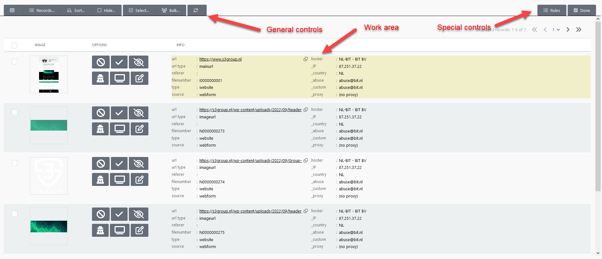
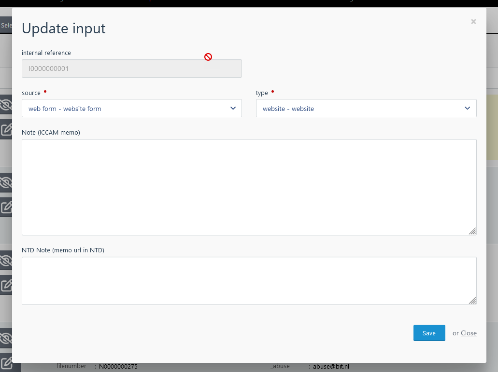

# Classification

---

Within the classify SCARt function reports can be classified. The function 
starts with a list of reports which can be selected and opened by the analyst.

In this list you can see if a report already is locked by an analyst. And you 
can select one or more reports to work on.

## Classify

**Note: the CLASSIFY function is the most "important" user screen with a lot of options 
to control everything. Advisable is to use this function on a large (bigger) screen.** 

When you open a report you find the following screen:

You find the following general controls:

| Name                                            | Description                                          |
|:------------------------------------------------|:-----------------------------------------------------|
|   | Switch between list and grid view                    
| Records...                                      | Number of records to display                         |
| Sort...                                         | Sort on                                              |
| Hide...                                         | Hide records or not                                  |
| Select...                                       | Select records based on status and current selection |
| Bulk...                                         | Do an action on the selected records                 | 
|                | Regresh the screen                                   |

Special controls:

| Name                                            | Description                                                        |
|:------------------------------------------------|:-------------------------------------------------------------------|
| Rules...| Rules maintenance for the domains of the current records |
| Done| Used to finalize everything (done)                                 | 

Work area:

In this area you have two different views; the LIST and the GRID view. 

In the GRID view you can specify how many columns are on the screen and you can scroll 
to the bottom till all the images are showed. 

In the LIST view you see only a group of records (5, 10, 25, or 50) and you can page 
through all the records. This view is handy when there are al lot of records (>100) 
and the classify screen becomes very busy with loading the images.

In each view the following buttons for each record are supported:

| Button                                  | Action             | Description |
|:----------------------------------------|:-------------------|:-|
|  | Set ILLEGAL        |Classify illegal|
|  | Set NOT ILLEGAL    |Classify legal|
|                | Set IGNORE         |Ignore (eg icon)|
|                | Set FIRST POLICE   |Send to LEA and wait|
|                | Set MANUAL         |Manual check whether online|
|                | Edit record fields |Edit different fields| 

FIRST POLICE is only possible when the record is classified as ILLEGAL. The 
abuse contact marked as POLICE will be informed by email with all the 
records (URL's) marked with FIRST POLICE.

Set MANUAL is also only possible when the record is ILLEGAL. When this is set 
SCARt will automatically only check the Whois information and will not check 
whether the URL (image) is online. In the function CHECKONLINE records can be set 
offline.

With EDIT a number of fields can be updated:

## Rules

With rules the flow and e.g. hosting records can be overruled. You can set the hoster 
or site owner based on the domain or set a proxy service (like CloudFlare) for 
determining the real IP. 

The RULES function is available within the classify function with only the options
(domains) valid for the records and as general function with all the possiblities.

See [Rules](../details/rules.md) for more information.
