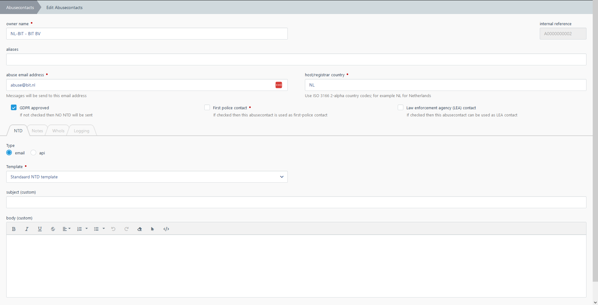

# Abuse contacts

---

Abuse contacts in SCARt are used for:

- hoster contact information
- registrar contact information
- site owner contact information
- police contact information
- LEA contact information

## Creation 

Contact records are automatically created by SCARt when a contact is not already found 
based on:

- name
- aliases
- abuse email address

When a contact is created by SCARt, the GDPR approved flag is NOT set then reports with this 
contact will be placed in the CHANGED status. 

First an analyst has to check the contact information such as email address, country and 
GDPR approved flag. Once checked, the analyst can confirm these fields so this abuse contact 
can be used.

## Specific NTD email template

An example of an abuse contact detail screen:

For each contact a specific NTD (LEA) email template can be set. You can use the same 
syntax for the body as specified in [NTD email templates](../basic/ntd.md). 

## API linker check

Some hosters support an API to support automatical retrieval of illegal URL's in order to 
automatically and immediately remove these images.

Contact your SCARt provider for adding a specific API for a hoster to SCARt. 

