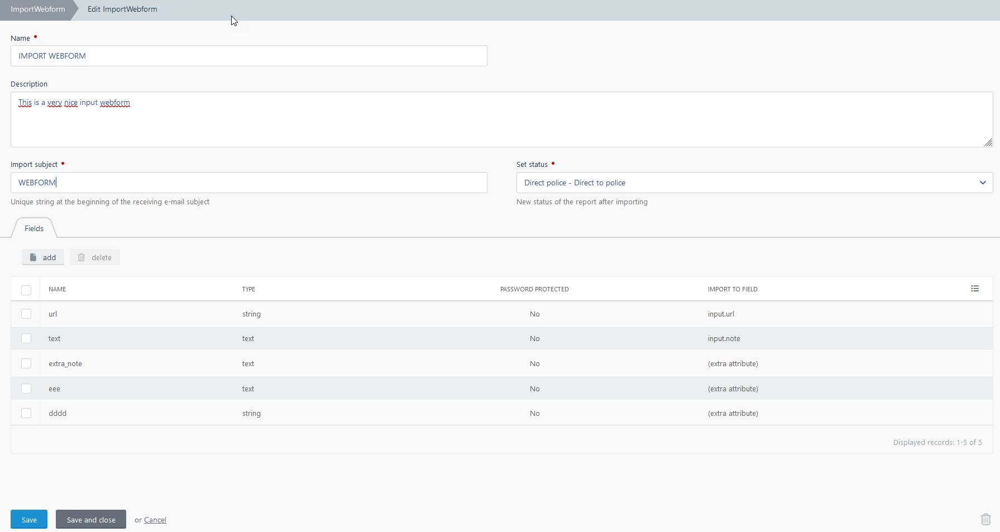
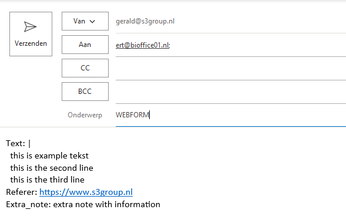
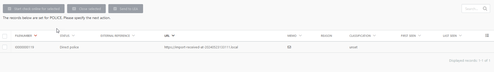
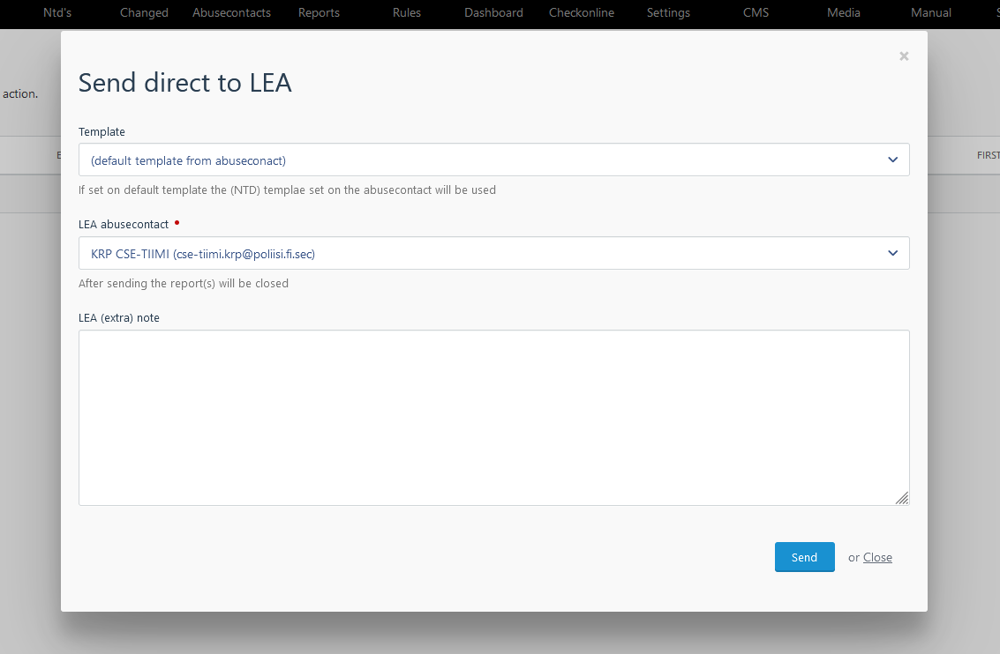

# Webform Import & Handling manual

---

(note: release 6.5 build 24 or later)

## Introduction

With the Webform import functionality different kind of webforms (website and/or 
webapplication) inputs can be processed by SCART. A webform with only an URL input 
field can be setup, but also a webform with a text field and no URL input. The 
webform definition in SCART can be configured so no URL is needed (no scraping 
will be done) and the webform information can be directly send to the police from 
within SCART.

## Webform definitions

In SCART you go to SETTINGS -> Import webforms for the webform definitions.

There you can define a Webform.

| Name           |Description|
|----------------|:-|
| Description    |(optional) Description of the purpose of the webform|
| Import subject |Unique email subject prefix |
| Set status     |The next status in SCARt when successfully imported |
| Fields         |A list of webform input fields|

You can define several (webform input) fields. The import function will try to map 
each field to a field within SCARt. The basic fields are URL, referrer and note. 
When importing, SCARt will put the imported values from these fields into the 
corresponding field in SCARt. The fields URL and referrer will be validated based 
on the uniform resource locator (URL) pattern.

You can also set the import field on “(extra attribute)”. In that case this field 
will be imported as an extra attribute, the name of the field can be anything.

## Import email format

The import mail function uses the YAML (Yet Another Markup Language) format for 
importing the webform fields. The purpose of this format is to have a 
human-readable data serialization language which simply can be read by the computer.

Note: a good tutorial about the YAML format you can find here: 
<https://www.cloudbees.com/blog/yaml-tutorial-everything-you-need-get-started>

This format can be used within the body from the import email with all (or a subset) 
of fields included. An example email body text is:

> url: www.s3group.nl \
> text: this is a note \
> custom: this a custom field 

a complete example of such a email is:

Each SCART environment has his own specific import email address. Please ask your 
SCART system admin to get this email address. Also note that your sender email 
address has to be on the whitelist in SCARt so the import emails will be 
handled (this is for security reasons).

## Direct to police - LEA contacts

When the “set status” field in the webform is set on ”Direct police”, the import 
webform can directly be handled within the POLICE function (see next paragraphs).

Under ABUSECONTACTS you can (must) specify which contacts can be used as LEA contact.
Simple check the box “Law enforcement agency (LEA) contact” in the Abusecontact 
detail function.

# Handling

## Webforms scrape enabled

When you set the “set status” field in the webform on “Open” or “Scrape”, SCARt 
will try to scrape the imported report. Note that an URL field has to be present 
in the import email.

## Webforms text only

When you set the “set status” field in the webform on “Direct police”, SCART will 
not scrape this report and send it directly to the POLICE function.

In the POLICE function you see for example:

When you check a report and then click on Send to LEA you get something like:

You can select the LEA contact, (optional) the template and can provide extra LEA 
info.

## Email template format

Within the template body you can use references to the specific webform fields. 
By default the following fields are available:

- Input.url
- Input.note
- Input.referer

The other fields (extra attributes) can be used by their custom name.

An example body text is:

> Dear Sir/Madam, \
> \
> We have received the following info for you: \
> {input.note} \
> \
> Extra LEA info: \
> {input.ntd_note} \
> \
> Extra field: {extra_field} \
> \
> With kind regards

You can use this in the body part in a general (NTD) template or in a specific one 
for an abusecontact.

## Reporting 

Within the function Report also the “text only” or “no url” reports can be exported. 
This can simply be done by filtering on CLOSE and UNSET classification. 

It is preferable to select under COLUMNS only the useful columns. You can here also 
specify the columns "LEA" which is filled with "y" when the report is send to a LEA.

