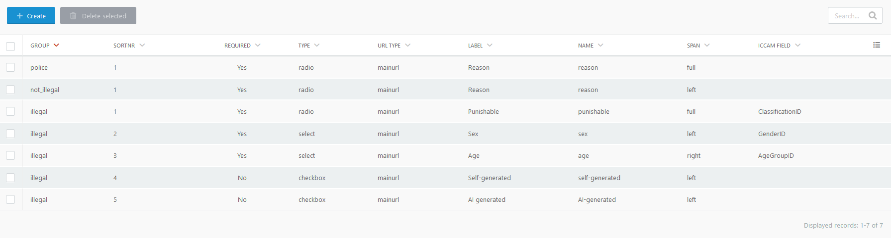

# Classify questions

---

The classiffication is done by a set of questions. These questions can be definied by 
the SCART administrator. 

Questions can general be defined for mainurl (report) or imageurl (content). When no imageurl 
questions are defined, then an imageurl will get the mainurl questions.

Different types of questions can be defined:

| type | description                         |
|:---|:------------------------------------|
| radio | options with only one checked       |
| checkbox | options with none or multi checked  |             
| select | options with none or multi selected |
| text | text input                          |

You can define the order in which questions are displayed, and also if the field is 
displayed full width of at the right or left (two column).

## ICCAM

If ICCAM is active, a question can also be connected to an ICCAM field. The options will
then be set on ICCAM defined values and cannot be changed.

